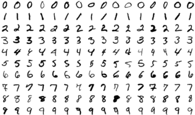

# MNIST Digit Classification using Neural Network

  

### Overview
This repository contains the code for a deep learning project that uses a neural network to classify handwritten digits from the MNIST dataset. The MNIST dataset is a popular benchmark in the field of computer vision and deep learning, consisting of 28x28 pixel grayscale images of handwritten digits (0 through 9).

### Introduction
In this project, we have implemented a neural network using Python and the popular deep learning framework, TensorFlow. The neural network is trained on the MNIST dataset to learn and recognize handwritten digits. Once trained, it can predict the digit present in an input image with a high level of accuracy.

### Project Overview
**Our project aims to:**

- **Facilitate Understanding:** We provide a comprehensive framework for understanding digit classification using deep learning.
- **Hands-On Learning:** By exploring this repository, you can experiment with training, evaluation, and usage aspects of digit classification models.
- **Customization:** The neural network architecture is designed for flexibility, allowing you to customize it according to your specific needs.

### Dataset
The MNIST dataset is the foundation of this project and is included under the data directory. It comprises two essential subsets:

- **Training Set:** 60,000 images used for training the neural network.
- **Testing Set:** 10,000 images used to assess the model's accuracy and generalization.
- Each image in these datasets is 28x28 pixels, and pixel intensities are represented on a scale from 0 to 255.

### Neural Network Architecture
Our neural network architecture for digit classification comprises the following layers:

- **Input Layer:** 784 neurons (28x28 pixels flattened).
- **Hidden Layer 1:** 1024 neurons with ReLU activation.
- **Hidden Layer 2:** 128 neurons with ReLU activation.
- **Output Layer:** 10 neurons (one for each digit) with softmax activation.
The model is designed for further customization and can be used for training, evaluation, and making predictions.

### Contributing
We highly encourage contributions to this project. You can participate by forking the repository, implementing enhancements, and submitting a pull request. If you encounter issues or have valuable suggestions, please don't hesitate to open an issue.

### License
This project is open-source and is licensed under the GPU License. For complete details, refer to the LICENSE file.

